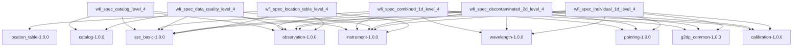

```mermaid
flowchart TD
  wfi_spec_catalog_level_4[wfi_spec_catalog_level_4] --> catalog_1_0_0[catalog-1.0.0]
  wfi_spec_catalog_level_4[wfi_spec_catalog_level_4] --> instrument_1_0_0[instrument-1.0.0]
  wfi_spec_catalog_level_4[wfi_spec_catalog_level_4] --> observation_1_0_0[observation-1.0.0]
  wfi_spec_catalog_level_4[wfi_spec_catalog_level_4] --> ssc_basic_1_0_0[ssc_basic-1.0.0]
  wfi_spec_combined_1d_level_4[wfi_spec_combined_1d_level_4] --> calibration_1_0_0[calibration-1.0.0]
  wfi_spec_combined_1d_level_4[wfi_spec_combined_1d_level_4] --> g2dp_common_1_0_0[g2dp_common-1.0.0]
  wfi_spec_combined_1d_level_4[wfi_spec_combined_1d_level_4] --> instrument_1_0_0[instrument-1.0.0]
  wfi_spec_combined_1d_level_4[wfi_spec_combined_1d_level_4] --> observation_1_0_0[observation-1.0.0]
  wfi_spec_combined_1d_level_4[wfi_spec_combined_1d_level_4] --> pointing_1_0_0[pointing-1.0.0]
  wfi_spec_combined_1d_level_4[wfi_spec_combined_1d_level_4] --> ssc_basic_1_0_0[ssc_basic-1.0.0]
  wfi_spec_combined_1d_level_4[wfi_spec_combined_1d_level_4] --> wavelength_1_0_0[wavelength-1.0.0]
  wfi_spec_data_quality_level_4[wfi_spec_data_quality_level_4] --> catalog_1_0_0[catalog-1.0.0]
  wfi_spec_data_quality_level_4[wfi_spec_data_quality_level_4] --> instrument_1_0_0[instrument-1.0.0]
  wfi_spec_data_quality_level_4[wfi_spec_data_quality_level_4] --> observation_1_0_0[observation-1.0.0]
  wfi_spec_data_quality_level_4[wfi_spec_data_quality_level_4] --> ssc_basic_1_0_0[ssc_basic-1.0.0]
  wfi_spec_decontaminated_2d_level_4[wfi_spec_decontaminated_2d_level_4] --> calibration_1_0_0[calibration-1.0.0]
  wfi_spec_decontaminated_2d_level_4[wfi_spec_decontaminated_2d_level_4] --> g2dp_common_1_0_0[g2dp_common-1.0.0]
  wfi_spec_decontaminated_2d_level_4[wfi_spec_decontaminated_2d_level_4] --> instrument_1_0_0[instrument-1.0.0]
  wfi_spec_decontaminated_2d_level_4[wfi_spec_decontaminated_2d_level_4] --> observation_1_0_0[observation-1.0.0]
  wfi_spec_decontaminated_2d_level_4[wfi_spec_decontaminated_2d_level_4] --> pointing_1_0_0[pointing-1.0.0]
  wfi_spec_decontaminated_2d_level_4[wfi_spec_decontaminated_2d_level_4] --> ssc_basic_1_0_0[ssc_basic-1.0.0]
  wfi_spec_decontaminated_2d_level_4[wfi_spec_decontaminated_2d_level_4] --> wavelength_1_0_0[wavelength-1.0.0]
  wfi_spec_individual_1d_level_4[wfi_spec_individual_1d_level_4] --> calibration_1_0_0[calibration-1.0.0]
  wfi_spec_individual_1d_level_4[wfi_spec_individual_1d_level_4] --> g2dp_common_1_0_0[g2dp_common-1.0.0]
  wfi_spec_individual_1d_level_4[wfi_spec_individual_1d_level_4] --> instrument_1_0_0[instrument-1.0.0]
  wfi_spec_individual_1d_level_4[wfi_spec_individual_1d_level_4] --> observation_1_0_0[observation-1.0.0]
  wfi_spec_individual_1d_level_4[wfi_spec_individual_1d_level_4] --> pointing_1_0_0[pointing-1.0.0]
  wfi_spec_individual_1d_level_4[wfi_spec_individual_1d_level_4] --> ssc_basic_1_0_0[ssc_basic-1.0.0]
  wfi_spec_individual_1d_level_4[wfi_spec_individual_1d_level_4] --> wavelength_1_0_0[wavelength-1.0.0]
  wfi_spec_location_table_level_4[wfi_spec_location_table_level_4] --> instrument_1_0_0[instrument-1.0.0]
  wfi_spec_location_table_level_4[wfi_spec_location_table_level_4] --> location_table_1_0_0[location_table-1.0.0]
  wfi_spec_location_table_level_4[wfi_spec_location_table_level_4] --> observation_1_0_0[observation-1.0.0]
  wfi_spec_location_table_level_4[wfi_spec_location_table_level_4] --> ssc_basic_1_0_0[ssc_basic-1.0.0]
```
