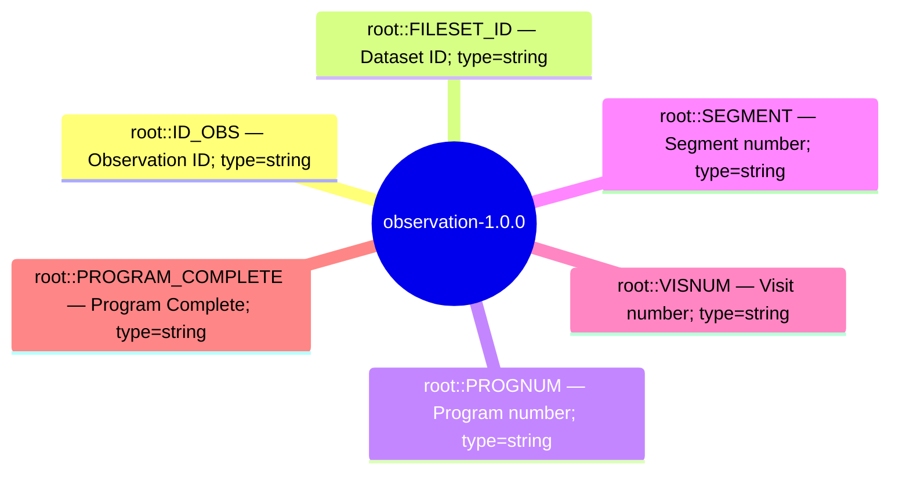

```mermaid
mindmap
  root((observation-1.0.0))
    root::ID_OBS — Observation ID; type=string
    root::FILESET_ID — Dataset ID; type=string
    root::PROGNUM — Program number; type=string
    root::SEGMENT — Segment number; type=string
    root::VISNUM — Visit number; type=string
    root::PROGRAM_COMPLETE — Program Complete; type=string
```
