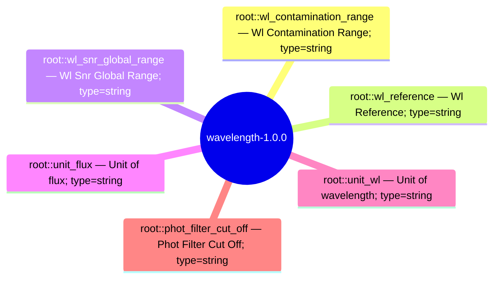

```mermaid
mindmap
  root((wavelength-1.0.0))
    root::wl_contamination_range — Wl Contamination Range; type=string
    root::wl_reference — Wl Reference; type=string
    root::wl_snr_global_range — Wl Snr Global Range; type=string
    root::unit_flux — Unit of flux; type=string
    root::unit_wl — Unit of wavelength; type=string
    root::phot_filter_cut_off — Phot Filter Cut Off; type=string
```
