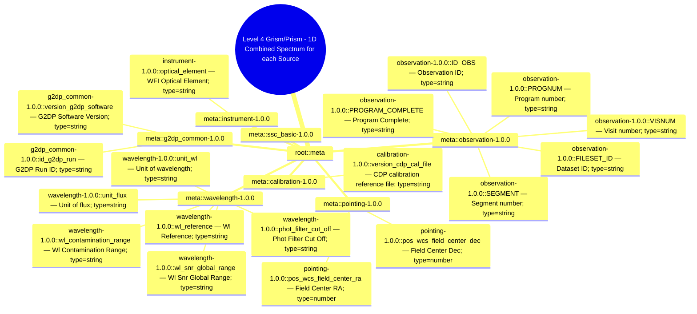

```mermaid
mindmap
  root((Level 4 Grism/Prism - 1D Combined Spectrum for each Source))
    root::meta
      meta::ssc_basic-1.0.0
      meta::observation-1.0.0
        observation-1.0.0::ID_OBS — Observation ID; type=string
        observation-1.0.0::FILESET_ID — Dataset ID; type=string
        observation-1.0.0::PROGNUM — Program number; type=string
        observation-1.0.0::SEGMENT — Segment number; type=string
        observation-1.0.0::VISNUM — Visit number; type=string
        observation-1.0.0::PROGRAM_COMPLETE — Program Complete; type=string
      meta::instrument-1.0.0
        instrument-1.0.0::optical_element — WFI Optical Element; type=string
      meta::calibration-1.0.0
        calibration-1.0.0::version_cdp_cal_file — CDP calibration reference file; type=string
      meta::wavelength-1.0.0
        wavelength-1.0.0::wl_contamination_range — Wl Contamination Range; type=string
        wavelength-1.0.0::wl_reference — Wl Reference; type=string
        wavelength-1.0.0::wl_snr_global_range — Wl Snr Global Range; type=string
        wavelength-1.0.0::unit_flux — Unit of flux; type=string
        wavelength-1.0.0::unit_wl — Unit of wavelength; type=string
        wavelength-1.0.0::phot_filter_cut_off — Phot Filter Cut Off; type=string
      meta::pointing-1.0.0
        pointing-1.0.0::pos_wcs_field_center_ra — Field Center RA; type=number
        pointing-1.0.0::pos_wcs_field_center_dec — Field Center Dec; type=number
      meta::g2dp_common-1.0.0
        g2dp_common-1.0.0::version_g2dp_software — G2DP Software Version; type=string
        g2dp_common-1.0.0::id_g2dp_run — G2DP Run ID; type=string
```
