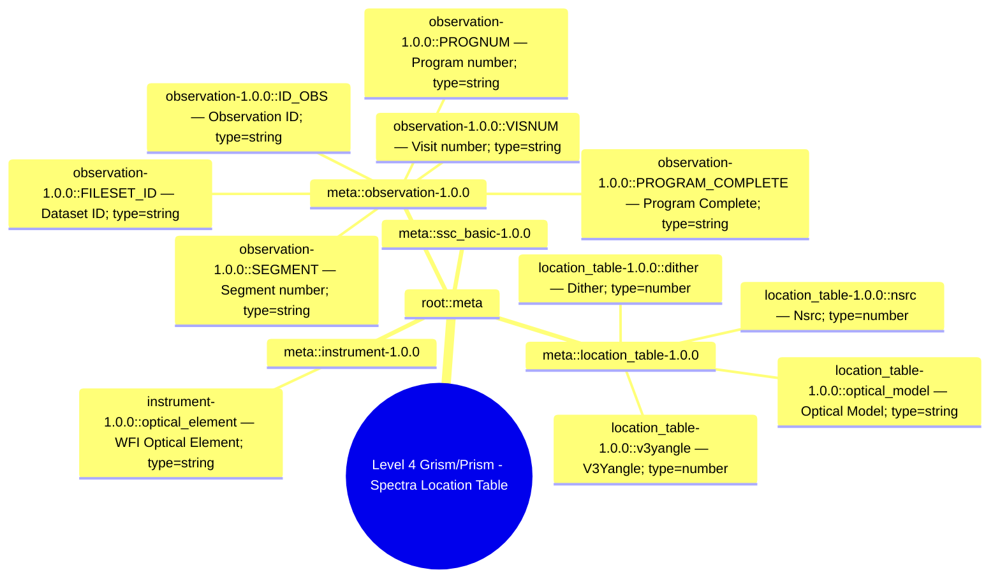

```mermaid
mindmap
  root((Level 4 Grism/Prism - Spectra Location Table))
    root::meta
      meta::ssc_basic-1.0.0
      meta::observation-1.0.0
        observation-1.0.0::ID_OBS — Observation ID; type=string
        observation-1.0.0::FILESET_ID — Dataset ID; type=string
        observation-1.0.0::PROGNUM — Program number; type=string
        observation-1.0.0::SEGMENT — Segment number; type=string
        observation-1.0.0::VISNUM — Visit number; type=string
        observation-1.0.0::PROGRAM_COMPLETE — Program Complete; type=string
      meta::instrument-1.0.0
        instrument-1.0.0::optical_element — WFI Optical Element; type=string
      meta::location_table-1.0.0
        location_table-1.0.0::dither — Dither; type=number
        location_table-1.0.0::nsrc — Nsrc; type=number
        location_table-1.0.0::optical_model — Optical Model; type=string
        location_table-1.0.0::v3yangle — V3Yangle; type=number
```
