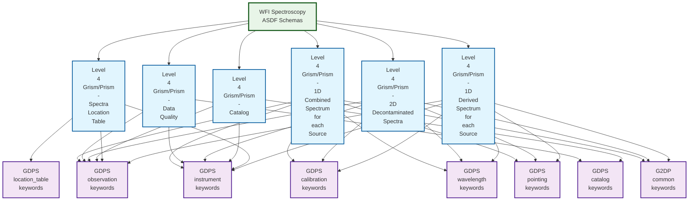

# WFI Spectroscopy ASDF Schemas - Mermaid Diagram

```mermaid
graph TD
    %% Roman WFI Spectroscopy ASDF Schema Structure

    ROOT["WFI Spectroscopy<br/>ASDF Schemas"]

    WFISPECINDIVIDUAL1DLEVEL4["Level<br/>4<br/>Grism/Prism<br/>-<br/>1D<br/>Derived<br/>Spectrum<br/>for<br/>each<br/>Source"]
    ROOT --> WFISPECINDIVIDUAL1DLEVEL4
    WFISPECLOCATIONTABLELEVEL4["Level<br/>4<br/>Grism/Prism<br/>-<br/>Spectra<br/>Location<br/>Table"]
    ROOT --> WFISPECLOCATIONTABLELEVEL4
    WFISPECCATALOGLEVEL4["Level<br/>4<br/>Grism/Prism<br/>-<br/>Catalog"]
    ROOT --> WFISPECCATALOGLEVEL4
    WFISPECDECONTAMINATED2DLEVEL4["Level<br/>4<br/>Grism/Prism<br/>-<br/>2D<br/>Decontaminated<br/>Spectra"]
    ROOT --> WFISPECDECONTAMINATED2DLEVEL4
    WFISPECDATAQUALITYLEVEL4["Level<br/>4<br/>Grism/Prism<br/>-<br/>Data<br/>Quality"]
    ROOT --> WFISPECDATAQUALITYLEVEL4
    WFISPECCOMBINED1DLEVEL4["Level<br/>4<br/>Grism/Prism<br/>-<br/>1D<br/>Combined<br/>Spectrum<br/>for<br/>each<br/>Source"]
    ROOT --> WFISPECCOMBINED1DLEVEL4

    OBSERVATION["GDPS<br/>observation<br/>keywords"]
    WFISPECINDIVIDUAL1DLEVEL4 --> OBSERVATION
    INSTRUMENT["GDPS<br/>instrument<br/>keywords"]
    WFISPECINDIVIDUAL1DLEVEL4 --> INSTRUMENT
    CALIBRATION["GDPS<br/>calibration<br/>keywords"]
    WFISPECINDIVIDUAL1DLEVEL4 --> CALIBRATION
    WAVELENGTH["GDPS<br/>wavelength<br/>keywords"]
    WFISPECINDIVIDUAL1DLEVEL4 --> WAVELENGTH
    POINTING["GDPS<br/>pointing<br/>keywords"]
    WFISPECINDIVIDUAL1DLEVEL4 --> POINTING
    G2DPCOMMON["G2DP<br/>common<br/>keywords"]
    WFISPECINDIVIDUAL1DLEVEL4 --> G2DPCOMMON
    OBSERVATION["GDPS<br/>observation<br/>keywords"]
    WFISPECLOCATIONTABLELEVEL4 --> OBSERVATION
    INSTRUMENT["GDPS<br/>instrument<br/>keywords"]
    WFISPECLOCATIONTABLELEVEL4 --> INSTRUMENT
    LOCATIONTABLE["GDPS<br/>location_table<br/>keywords"]
    WFISPECLOCATIONTABLELEVEL4 --> LOCATIONTABLE
    OBSERVATION["GDPS<br/>observation<br/>keywords"]
    WFISPECCATALOGLEVEL4 --> OBSERVATION
    INSTRUMENT["GDPS<br/>instrument<br/>keywords"]
    WFISPECCATALOGLEVEL4 --> INSTRUMENT
    CATALOG["GDPS<br/>catalog<br/>keywords"]
    WFISPECCATALOGLEVEL4 --> CATALOG
    OBSERVATION["GDPS<br/>observation<br/>keywords"]
    WFISPECDECONTAMINATED2DLEVEL4 --> OBSERVATION
    INSTRUMENT["GDPS<br/>instrument<br/>keywords"]
    WFISPECDECONTAMINATED2DLEVEL4 --> INSTRUMENT
    CALIBRATION["GDPS<br/>calibration<br/>keywords"]
    WFISPECDECONTAMINATED2DLEVEL4 --> CALIBRATION
    WAVELENGTH["GDPS<br/>wavelength<br/>keywords"]
    WFISPECDECONTAMINATED2DLEVEL4 --> WAVELENGTH
    POINTING["GDPS<br/>pointing<br/>keywords"]
    WFISPECDECONTAMINATED2DLEVEL4 --> POINTING
    G2DPCOMMON["G2DP<br/>common<br/>keywords"]
    WFISPECDECONTAMINATED2DLEVEL4 --> G2DPCOMMON
    OBSERVATION["GDPS<br/>observation<br/>keywords"]
    WFISPECDATAQUALITYLEVEL4 --> OBSERVATION
    INSTRUMENT["GDPS<br/>instrument<br/>keywords"]
    WFISPECDATAQUALITYLEVEL4 --> INSTRUMENT
    CATALOG["GDPS<br/>catalog<br/>keywords"]
    WFISPECDATAQUALITYLEVEL4 --> CATALOG
    OBSERVATION["GDPS<br/>observation<br/>keywords"]
    WFISPECCOMBINED1DLEVEL4 --> OBSERVATION
    INSTRUMENT["GDPS<br/>instrument<br/>keywords"]
    WFISPECCOMBINED1DLEVEL4 --> INSTRUMENT
    CALIBRATION["GDPS<br/>calibration<br/>keywords"]
    WFISPECCOMBINED1DLEVEL4 --> CALIBRATION
    WAVELENGTH["GDPS<br/>wavelength<br/>keywords"]
    WFISPECCOMBINED1DLEVEL4 --> WAVELENGTH
    POINTING["GDPS<br/>pointing<br/>keywords"]
    WFISPECCOMBINED1DLEVEL4 --> POINTING
    G2DPCOMMON["G2DP<br/>common<br/>keywords"]
    WFISPECCOMBINED1DLEVEL4 --> G2DPCOMMON

    %% Styling
    classDef mainSchema fill:#e1f5fe,stroke:#01579b,stroke-width:2px
    classDef keywordSchema fill:#f3e5f5,stroke:#4a148c,stroke-width:2px
    classDef rootNode fill:#e8f5e8,stroke:#1b5e20,stroke-width:3px

    class ROOT rootNode
    class WFISPECINDIVIDUAL1DLEVEL4 mainSchema
    class WFISPECLOCATIONTABLELEVEL4 mainSchema
    class WFISPECCATALOGLEVEL4 mainSchema
    class WFISPECDECONTAMINATED2DLEVEL4 mainSchema
    class WFISPECDATAQUALITYLEVEL4 mainSchema
    class WFISPECCOMBINED1DLEVEL4 mainSchema
    class WAVELENGTH keywordSchema
    class LOCATIONTABLE keywordSchema
    class POINTING keywordSchema
    class CALIBRATION keywordSchema
    class CATALOG keywordSchema
    class G2DPCOMMON keywordSchema
    class OBSERVATION keywordSchema
    class INSTRUMENT keywordSchema
```